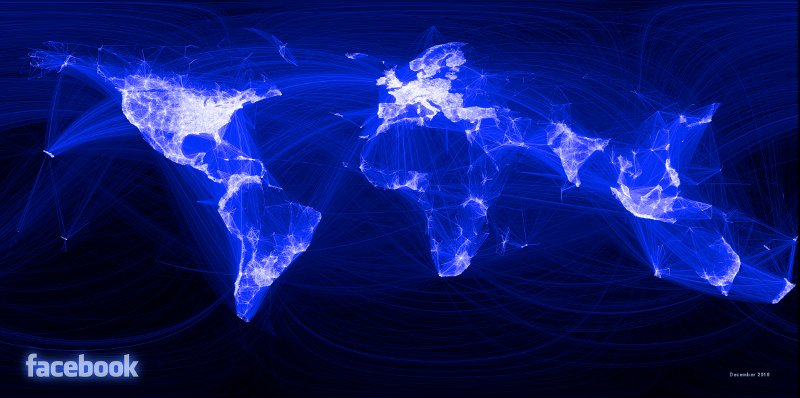

Introduction
============

What is R?
----------

R is a free and open source computer program that runs on all major
operating systems. It relies primarily on the *command line* for data
input. This means that instead of interacting with the program by clicking on different 
parts of the screen, users type commands for the operations they wish to complete. This seems a little daunting at first but 
the approach has a number of benefits, as highlighted by Gary Sherman (2008,
p. 283), developer of the popular Geographical Information System (GIS) QGIS:

> With the advent of “modern” GIS software, most people want to point
> and click their way through life. That’s good, but there is a
> tremendous amount of flexibility and power waiting for you with the
> command line. Many times you can do something on the command line in a
> fraction of the time you can do it with a GUI.

The joy of this, when you get accustomed to it, is that any command is
only ever a few keystrokes away, and the order of the commands sent to R
can be stored and repeated in scripts, saving time in the
long-term. In addition, R encourages truly transparent and reproducible 
research by removing an economic barrier to quantitative analysis and encouraging documentation of code.
It is possible for anyone with the R installed 
to reproduce all the steps used by othered. This 
is facilitated by the RStudio program, that makes it easy to include
'live' R code in text documents. 

In R what the user inputs is the same
as what R sees when it processes the request. Access to
R's source code and openness about how it works has enabled many programmers to improve R over time and add an incredible number
of extensions to its capabilities. There
are now more than 4000 official add-on *packages* for R, allowing it to tackle
almost any numerical problem. If there is a useful
function that R cannot currently perform, there is a good
chance that someone is working on a solution that will become available
at a later date. One area
where extension of R's basic capabilities has been particularly
successful in recent years is the addition of a wide variety of spatial analysis and visualisation tools
(Bivand et al. 2013). The latter will be the focus of this chapter.

Why R for spatial data visualisation?
-------------------------------------

R was conceived - and is
still primarily known - for its capabilities as a "statistical programming language" (Bivand
and Gebhardt 2000). 
Statistical analysis functions remain core to the package but there is a
broadening of functionality to reflect a growing user base across disciplines.
R has become "an integrated suite of software facilities for data manipulation,
calculation and graphical display" (Venables et al. 2013). 
Spatial data analysis and visualisation is an important growth area within this 
increased functionality.
The map of Facebook friendships produced by Paul Butler, for example, is iconic in this regard, 
and has reached a global audience (Figure 1). 
This shows linkages between friends as lines across the curved surface of the 
Earth (using the `geosphere` package). The secret to the success of this map
was the time taken to select the appropriate colour palette,
line widths and transparency for the plot. 
As we discuss in Section 3 the importance of such details cannot be overstated.
They can be the difference between a stunning graphic and an impenetrable mess.

The map helped inspire the R community to produce more ambitious
graphics, a process fuelled by increased demand for data visualisation and the
development of packages that augment R's preinstalled 'base graphics'. 
Thus R has become a key tool for analysis and visualisation
used by the likes of Twitter, the New York Times and Google. Thousands of
consultants, design houses and journalists also rely on R: it is no longer merely the preserve of academic 
research and many graduate jobs now list R as a desirable skill. 

Finally, it is worth noting a few key differences between R and traditional GIS
software such as QGIS. While dedicated GIS programs handle spatial data by default and
display the results in a single way, there are various options in R that
must be decided by the user (for example whether to use R's base
graphics or a dedicated graphics package such as ggplot2).
Indeed, it is this flexibility, illustrated by the custom map of shipping 
routes in Section 4 of this chapter, that makes R so attractive.
Another benefit of R compared with traditional approaches to GIS is that it facilitates
*transparency* of research, a feature that we will be using to
great effect in this chapter: all of the results presented in the subsequent sections
can be reproduced (and modified) at home, as described in the next section. 
