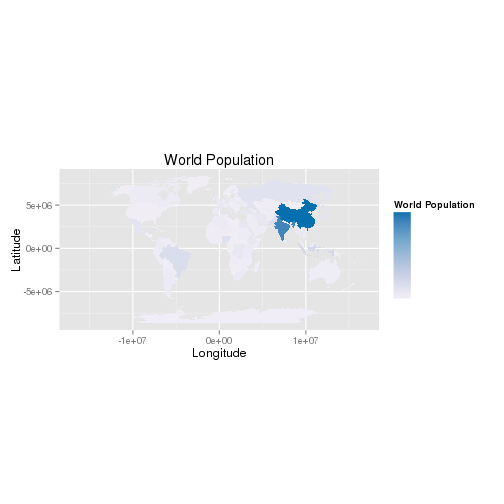

Fundamentals of Spatial Data Visualisation
==========================================

Good maps depend on sound analysis and can have an enormous impact on the 
understanding and communication of results. 
Thanks to new data sources and programs such as R, it has never been easier to produce a map. 
Spatial datasets are now available in unprecedented volumes 
and tools for transforming them into compelling
maps and graphics are becoming increasingly sophisticated accessible. 
Data and software, however, only offer the starting points of good spatial 
data visualisation. Graphics need to be refined and calibrated 
to best communicate the message contained in the data.  This section describes the
features of a good map. Not all good maps and 
graphics *must* contain all the features below: they should be seen 
as suggestions rather than firm principles.

Effective map making is difficult process, as Krygier and Wood (2011)
put it: "there is a lot to see, think about, and do" (p6). 
Visualisation usually comes at the end of a period of data analysis
and, perhaps when the priority is to finish an assignment, is tempting to rush. 
The beauty of R (and other scripting languages) is the ability to 
save code and re-run it. 
Colours, map adornments and other parameters can therefore be quickly applied, 
so it is worth spending time creating a template script that adheres to best practice.

We use *ggplot2* as the package of choice to produce most of 
the maps presented in this chapter because it easily facilitates good practice in data visualisation. 
The "gg" in its name stands for
"Grammar of Graphics", a set of rules developed 
by Wilkinson (2005). 
Grammar in the context of graphics works in much the same way as it does in language:
it provides a structure. The structure is informed by both human perception 
and also mathematics to ensure that the resulting visualisations are 
technically sound and comprehensible. By creating ggplot2 
Hadley Wickham implemented these rules, including a syntax
for building graphics in layers using the `+` symbol (see Wickham, 2010).
This layering component is especially useful in the context of
spatial data since it is conceptually the same as map layers in
conventional GIS.

First ensure that the necessary packages are installed and 
that R is in the correct working directory.
Then load the ggplot2 package used in this section.


```r
library(ggplot2)
```


We are going to use the previously loaded map of the world to demonstrate 
some of the cartographic principles as they are introduced. To establish 
the starting point, find the first 35 column names of the `wrld` object:


```r
names(wrld@data)[1:35]
```

```
##  [1] "scalerank"  "featurecla" "labelrank"  "sovereignt" "sov_a3"    
##  [6] "adm0_dif"   "level"      "type"       "admin"      "adm0_a3"   
## [11] "geou_dif"   "geounit"    "gu_a3"      "su_dif"     "subunit"   
## [16] "su_a3"      "brk_diff"   "name"       "name_long"  "brk_a3"    
## [21] "brk_name"   "brk_group"  "abbrev"     "postal"     "formal_en" 
## [26] "formal_fr"  "note_adm0"  "note_brk"   "name_sort"  "name_alt"  
## [31] "mapcolor7"  "mapcolor8"  "mapcolor9"  "mapcolor13" "pop_est"
```


This shows many attribute columns associated with the `wrld` object.
Although we will keep all of them, we are only really interested in
population `("pop_est")`. Typing `summary(wrld$pop_est)`
provides basic descriptive statistics on population.

Before progressing, we will reproject the data to reduce 
distortion in the size of countries close to the North and South poles
(at the top and bottom of the above plot). 
The coordinate reference system of 
the wrld shapefile is currently WGS84, the most common latitude and 
longitude format that all spatial software packages understand. 
From a cartographic perspective this projection this is not ideal. 
Instead, the Robinson projection provides a good compromise
between areal distortion and shape preservation:


```r
wrld.rob <- spTransform(wrld, CRS("+proj=robin"))  #`+proj=robin` refers to the Robinson projection
plot(wrld.rob)
```

 


Now the countries in the world map are much better proportioned.
The above plots use R's *base graphics*. The function `fortify` must be used to convert
the spatial data it into a format
that ggplot2 understands. Then the `merge` function is used to re-attach the
attribute data lost during the fortify operation.


```r
wrld.rob.f <- fortify(wrld.rob, region = "sov_a3")
```

```
## Loading required package: rgeos
## rgeos version: 0.2-19, (SVN revision 394)
##  GEOS runtime version: 3.3.8-CAPI-1.7.8 
##  Polygon checking: TRUE
```

```r

# Use by.x and by.y arguments to specify the columns that match the two
# dataframes together:
wrld.pop.f <- merge(wrld.rob.f, wrld.rob@data, by.x = "id", by.y = "sov_a3")
```


The code below produces a map coloured by the population variable.
It demonstrates the syntax of ggplot2 by first stringing 
together a series of plot commands and assigning them to a single R 
object called `map`. If you type `map` into the command line, 
R will then execute the code and generate the plot. By  
specifying the `fill` variable within the `aes()` (short for 'aesthetics') argument, ggplot2 
colours the countries using a default colour palette and 
automatically generates a legend. `geom_polygon()` 
tells ggplot2 to plot polygons. As will be shown in the next section these
defaults can be easily altered to change a map's appearance.


```r
map <- ggplot(wrld.pop.f, aes(long, lat, group = group, fill = pop_est)) + geom_polygon() + 
    coord_equal() + labs(x = "Longitude", y = "Latitude", fill = "World Population") + 
    ggtitle("World Population")

map
```

 


## Colour and other aesthetics

Colour has an enormous impact on how people will perceive a graphic. 
Adjusting a colour palette from yellow to red or from green to blue, 
for example, can alter the readers' response. 
In addition, the use of colour to highlight particular regions 
or de-emphasise others are important tricks in cartography that shouldn't be overlooked. 
Below we present a few examples of how to create high quality maps with R. For more information about the importance of different features of a map for its interpretation, see Monmonier (1996).

### Choropleth Maps

ggplot2 knows the difference between continuous and categorical (nominal) variables and will automatically assign the appropriate colour palettes accordingly. The default colour palettes are generally a sensible place to start but users may wish to vary them for a whole host of reasons, such as the need to print in black and white. The `scale_fill_` family of commands enable such customisation. For categorical data, `scale_fill_manual()` can be used:


```r
# Produce a map of continents
map.cont <- ggplot(wrld.pop.f, aes(long, lat, group = group, fill = continent)) + 
    geom_polygon() + coord_equal() + labs(x = "Longitude", y = "Latitude", fill = "World Continents") + 
    ggtitle("World Continents")

# To see the default colours
map.cont
```

 


To change the colour scheme, we can set our own colours:


```r
map.cont + scale_fill_manual(values = c("yellow", "red", "purple", "white", 
    "orange", "blue", "green", "black"))
```


Whilst `scale_fill_continuous()` works with continuous datasets:


```r
# Note the use of the 'map' object created earler
map + scale_fill_continuous(low = "white", high = "black")

```


It is well worth looking at the *Color Brewer* palettes developed by Cynthia Brewer (see http://colorbrewer2.org). These are designed to be colour blind safe and perceptually uniform such that no one colour jumps out more than any others. This latter characteristic is important when trying to produce impartial maps. R has a package that contains the colour palettes and these can be easily utilised by ggplot2.


```r
library(RColorBrewer)
# look at the help documents to see the palettes available.
`?`(RColorBrewer)
# note the use of the scale_fill_gradientn() function rather than
# scale_fill_continuous() used above
map + scale_fill_gradientn(colours = brewer.pal(7, "YlGn"))
```


In addition to altering the colour scale used to represent continuous data it may also be desirable to adjust the breaks at which the colour transitions occur. There are many ways to select both the optimum number of breaks (i.e colour transitions) and the locations in the dataset at which they occur. This is important for the comprehension of a graphic since it alters the colours associated with each value. The `classINT` package contains many ways to automatically create these breaks. We use the `grid.arrange` function from the gridExtra package to display the maps side by side.


```r
library(classInt)
```

```
## Loading required package: class
## Loading required package: e1071
```

```r
library(gridExtra)
```

```
## Loading required package: grid
```

```r

# Specify how number of breaks - generally this should be fewer than 7
nbrks <- 6

# Here quantiles are used to identify the breaks Note that we are using the
# original 'wrld.rob' object and not the 'wrld.rob@data$pop_est.f' Use the
# help files (by typing ?classIntervals) to see the full range of options
brks <- classIntervals(wrld.rob@data$pop_est, n = nbrks, style = "quantile")

print(brks)

# Now the breaks can be easily inserted into the code above for a range of
# colour palettes
YlGn <- map + scale_fill_gradientn(colours = brewer.pal(nbrks, "YlGn"), breaks = c(brks$brks))

PuBu <- map + scale_fill_gradientn(colours = brewer.pal(nbrks, "PuBu"), breaks = c(brks$brks))

grid.arrange(YlGn, PuBu, ncol = 2)
```


If you are not happy with the automatic methods for specifying breaks it can also be done manually:


```r
nbrks <- 4
brks <- c(1e+08, 2.5e+08, 5e+07, 1e+09)
map + scale_fill_gradientn(colours = brewer.pal(nbrks, "PuBu"), breaks = c(brks))
```

 


There are many other ways to specify and alter the colours in ggplot2 and these are outlined in the help documentation.

If the map's purpose is to clearly communicate data then it is advisable to conform to widely used conventions. A good example of this is the use of blue for water and green for landmasses. The code example below generates two plots with the `wrld.pop.f` object. The first colours the land blue and the sea (in this case the background to the map) green. The second plot is more conventional.


```r
map2 <- ggplot(wrld.pop.f, aes(long, lat, group = group)) + coord_equal()

blue <- map2 + geom_polygon(fill = "light blue") + theme(panel.background = element_rect(fill = "dark green"))

green <- map2 + geom_polygon(fill = "dark green") + theme(panel.background = element_rect(fill = "light blue"))

grid.arrange(blue, green, ncol = 2)
```

 


### Experimenting with line colour and widths

Line colour and width are important parameters too often overlooked for increasing the legibility of a graphic. The code below demonstrates it is possible to adjust these using the `colour` and `lwd` arguments. The impact of different line widths will vary depending on your screen size and resolution. If you save the plot to pdf (e.g. using the `ggsave` command), this will also affect the relative line widths.


```r
map3 <- map2 + theme(panel.background = element_rect(fill = "light blue"))

yellow <- map3 + geom_polygon(fill = "dark green", colour = "yellow")

black <- map3 + geom_polygon(fill = "dark green", colour = "black")

thin <- map3 + geom_polygon(fill = "dark green", colour = "black", lwd = 0.1)

thick <- map3 + geom_polygon(fill = "dark green", colour = "black", lwd = 1.5)

grid.arrange(yellow, black, thick, thin, ncol = 2)
```

 


There are other parameters such as layer transparency (use the `alpha` parameter for this) that can be applied to all aspects of the plot - both points, lines and polygons. Space does not permit full exploration here but more information is available from the ggplot2 package documentation (see [ggplot2.org](http://ggplot2.org/)).

## Map Adornments and Annotations


Map adornments and annotations orientate the viewer and provide context. They include grids (also known as graticules), orientation arrows, scale bars and data attribution. Not all are required on a single map, indeed it is often best that they are used sparingly to avoid unnecessary clutter (Monkhouse and Wilkinson 1971). With ggplot2 scales and legends are provided by default, but they can be customised.


### North arrow

In the maps created so far, we have defined the *aesthetics* (`aes`) of the map
in the foundation function `ggplot()`. The result of this is that all
subsequent layers are expected to have the same variables.
But what if we want to add a new layer from a completely different
dataset, for example to add a north arrow? To do this, we must not add any arguments
to the `ggplot` function, only adding data sources one layer at a time:

Here we create an empty plot, meaning that each new layer must be given
its own dataset. While more code is needed in this example, it enables
much greater flexibility with regards to what can be included in new
layer contents. Another possibility is to use `geom_segment()` to add
a rudimentary arrow (see `?geom_segment` for refinements):


```r
library(grid)  # needed for arrow
ggplot() + geom_polygon(data = wrld.pop.f, aes(long, lat, group = group, fill = pop_est)) + 
    geom_line(aes(x = c(-1.3e+07, -1.3e+07), y = c(0, 5e+06)), arrow = arrow()) + 
    coord_fixed()  # correct aspect ratio
```

 


### Scale bar

ggplot2's scale bar capabilities are perhaps the least advanced element of the package. This approach will only work if the spatial data are in a projected coordinate system to ensure there are no distortions as a result of the curvature of the earth. In the case of the world map the distances at the equator in terms of degrees east to west are very different from those further north or south. Any line drawn using the the simple approach below would therefore be inaccurate. For maps covering large areas - such as the entire world - leaving the axis labels on will enable them to act as a graticule to indicate distance. We therefore load in a file containing the geometry of London's Boroughs. 


```r
load("data/lnd.f.RData")
ggplot() + geom_polygon(data = lnd.f, aes(long, lat, group = group)) + geom_line(aes(x = c(505000, 
    515000), y = c(158000, 158000)), lwd = 2) + annotate("text", label = "10km", 
    x = 510000, y = 160000) + coord_fixed()
```

 


### Legends

Legends are added automatically but can be customised in a number of ways. They are an important adornment of any map since they describe what its colours mean. Try to select colour breaks that are easy to follow and avoid labeling the legend with values that go to a large number of significant figures. A few examples of legend customisation are included below by way of introduction, but there are many more examples available in the ggplot2 documentation. 


```r
# Position
map + theme(legend.position = "top")
```

 


As you can see, this added the legend in a new place. Many more options for customization 
are available, as highlighted in the examples below.


```r
# Title
map + theme(legend.title = element_text(colour = "Red", size = 16, face = "bold"))

# Label Font Size and Colour
map + theme(legend.text = element_text(colour = "blue", size = 16, face = "italic"))

# Border and background box
map + theme(legend.background = element_rect(fill = "gray90", size = 0.5, linetype = "dotted"))
```


Adding Basemaps To Your Plots
----------

The development of the ggmap package has enabled the simple use of online mapping services such as Google Maps and OpenStreetMap for base maps. Using image tiles from these services spatial data can be placed in context as users can easily orientate themselves to streets and landmarks.

For this example we use data on London sports participation. The data were originally projected to British National Grid (BNG) which is not compatible with the online map services used in the following examples. It therefore needs reprojecting - a step we completed earlier. The reprojected file can be loaded as follows:


```r
load("data/lnd.wgs84.RData")
```


The first job is to calculate the bounding box (bb for short) of the 
`lnd.wgs84` object to identify the geographic extent of the map. This information is used to request the appropriate map tiles from the map service of our choice - a process conceptually the same as the size of your web browser or smartphone screen when using Google maps for navigation. The first line of code in the snippet below retrieves the bounding box and the two that follow add 5% so there is a little space around the edges of the data to be plotted.


```r
b <- bbox(lnd.wgs84)
b[1, ] <- (b[1, ] - mean(b[1, ])) * 1.05 + mean(b[1, ])
b[2, ] <- (b[2, ] - mean(b[2, ])) * 1.05 + mean(b[2, ])
# scale longitude and latitude (increase bb by 5% for plot) replace 1.05
# with 1.xx for an xx% increase in the plot size
```


This is then fed into the `get_map` function as the location parameter. The syntax below contains 2 functions. `ggmap` is required to produce the plot and provides the base map data.


```r
library(ggmap)

lnd.b1 <- ggmap(get_map(location = b))
```

```
## Warning: bounding box given to google - spatial extent only approximate.
```


`ggmap` follows the same syntax structures as ggplot2 and so can easily be integrated with the other examples included here. First `fortify` the `lnd.wgs84` object and then merge with the required attribute data.


```r
lnd.wgs84.f <- fortify(lnd.wgs84, region = "ons_label")
lnd.wgs84.f <- merge(lnd.wgs84.f, lnd.wgs84@data, by.x = "id", by.y = "ons_label")
```


We can now overlay this on our base map using the `geom_polygon()` function.


```r
lnd.b1 + geom_polygon(data = lnd.wgs84.f, aes(x = long, y = lat, group = group, 
    fill = Partic_Per), alpha = 0.5)
```


The resulting map looks reasonable, but it would be improved with a simpler base map in black and white. 
A design firm called *stamen* provide the tiles we need and they can be brought into the 
plot with the `get_map` function:


```r
lnd.b2 <- ggmap(get_map(location = b, source = "stamen", maptype = "toner", 
    crop = T))  # note the addition of the maptype parameter.
```


We can then produce the plot as before.


```r
lnd.b2 + geom_polygon(data = lnd.wgs84.f, aes(x = long, y = lat, group = group, 
    fill = Partic_Per), alpha = 0.5)
```


This produces a much clearer map and enables readers to focus on the data rather than the basemap. Spatial polygons are not the only data types compatible with `ggmap` - you can use any plot type and set of parameters available in `ggplot2`, making it an ideal companion package for spatial data visualisation. 


