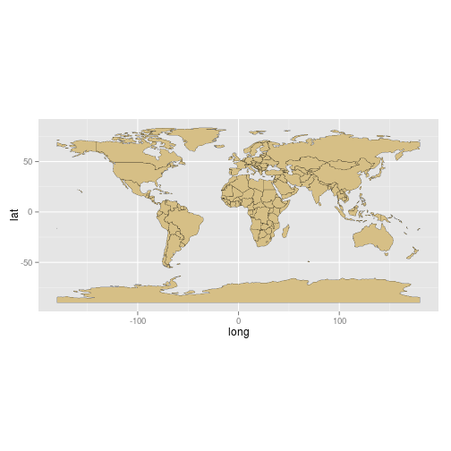
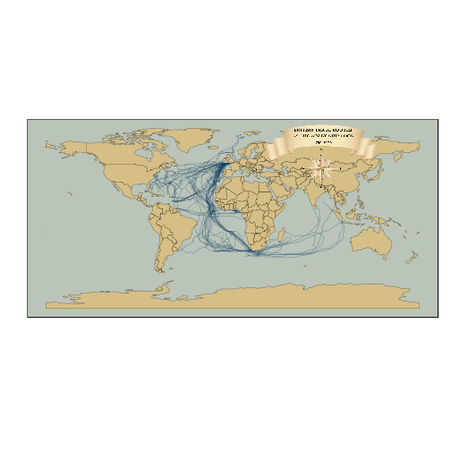
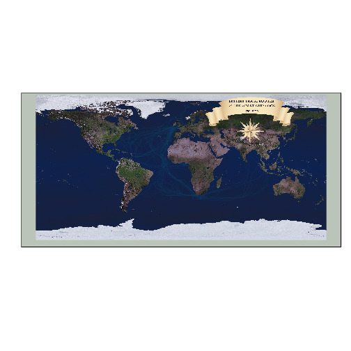

A Final Example
===============

Here we present a final example that draws upon the many advanced concepts discussed in 
this chapter to produce a map of 18th Century Shipping flows. The data have been obtained 
from the CLIWOC project and they represent a sample of digitised ships' logs from the 18th Century. 
We are using a very small sample of the the full dataset, which is available from here: 
http://pendientedemigracion.ucm.es/info/cliwoc/. 
The example has been chosen to demonstrate a range of capabilities 
within ggplot2 and the ways in which they can be applied to produce 
high-quality maps with only a few lines of code. 
We end by showing how the maps can be animated to chart
the routes over time and the ability of R to produce many maps very quickly.

As always, the first step is to load in the required packages and datasets. Here we are using the png package to load in a series of map annotations. These have been created in image editing software and will add a historic feel to the map. We are also loading in a World boundary shapefile and the shipping data itself. 


```r
library(rgdal)
library(ggplot2)
library(png)
wrld <- readOGR("data/", "ne_110m_admin_0_countries")
```

```
## OGR data source with driver: ESRI Shapefile 
## Source: "data/", layer: "ne_110m_admin_0_countries"
## with 177 features and 63 fields
## Feature type: wkbPolygon with 2 dimensions
```

```r
btitle <- readPNG("figure/brit_titles.png")
compass <- readPNG("figure/windrose.png")
bdata <- read.csv("data/british_shipping_example.csv")
```


If you look at the first few lines in the `bdata` object you will see there are 7 columns with each row representing a single point on the ships course. The year of the journey and the nationality of the ship are also included. The final 3 columns are identifiers that are used later to group the coordinate points together into the paths that ggplot2 plots.

We first specify some plot parameters that remove the axis labels.


```r
xquiet <- scale_x_continuous("", breaks = NULL)
yquiet <- scale_y_continuous("", breaks = NULL)
quiet <- list(xquiet, yquiet)
```


The next step is to `fortify` the World coastlines and create the base plot. This sets the extents of the plot window and provides the blank canvas on which we will build up the layers. The first layer created is the wrld object; the code is wrapped in `c()` to prevent it from executing by simply storing it as the plot's parameters. 


```r
wrld.f <- fortify(wrld, region = "sov_a3")
base <- ggplot(wrld.f, aes(x = long, y = lat))
wrld <- c(geom_polygon(aes(group = group), size = 0.1, colour = "black", fill = "#D6BF86", 
    data = wrld.f, alpha = 1))
```


To see the result of this simply type:


```r
base + wrld + coord_fixed()
```

 


The code snipped below creates the plot layer containing the the shipping routes. The `geom_path()`
function is used to string together the coordinates into the routes. 
You can see within the `aes()` component we have specified long and 
lat plus pasted together the trp and `group.regroup` variables to identify the unique paths.


```r
route <- c(geom_path(aes(long, lat, group = paste(bdata$trp, bdata$group.regroup, 
    sep = ".")), colour = "#0F3B5F", size = 0.2, data = bdata, alpha = 0.5, 
    lineend = "round"))
```


We now have all we need to generate the final plot by building the layers together with the `+` sign as shown in the code below. The first 3 arguments are the plot layers, and the parameters within `theme()` are changing the background colour to sea blue. `annotation_raster()` plots the png map adornments loaded in earlier- this requires the bounding box of each image to be specified. In this case we use latitude and longitude (in WGS84) and we can use these paramrters to change the png's position and also its size. The final two arguments fix the aspect ratio of the plot and remove the axis labels. 


```r
base + route + wrld + theme(panel.background = element_rect(fill = "#BAC4B9", 
    colour = "black")) + annotation_raster(btitle, xmin = 30, xmax = 140, ymin = 51, 
    ymax = 87) + annotation_raster(compass, xmin = 65, xmax = 105, ymin = 25, 
    ymax = 65) + coord_equal() + quiet
```

 


In the plot example we have chosen the colours carefully to give the appearance of a historic map. 
An alternative approach could be to use a satellite image as a base map. It is possible to use 
the readPNG function to import NASA's "Blue Marble" image for this purpose. Given that the 
route information is the same projection as the image it is very straightforward to set the 
image extent to span -180 to 180 degrees and -90 to 90 degrees and have it align with the 
shipping data. Producing the plot is accomplished using the code below. This offers a good 
example of where functionality designed without spatial data in mind can be harnessed for 
the purposes of producing interesting maps. Once you have produced the plot, alter the code 
to recolour the shipping routes to make them appear more clearly against the blue marble background. 


```r
earth <- readPNG("figure/earth_raster.png")

base + annotation_raster(earth, xmin = -180, xmax = 180, ymin = -90, ymax = 90) + 
    route + theme(panel.background = element_rect(fill = "#BAC4B9", colour = "black")) + 
    annotation_raster(btitle, xmin = 30, xmax = 140, ymin = 51, ymax = 87) + 
    annotation_raster(compass, xmin = 65, xmax = 105, ymin = 25, ymax = 65) + 
    coord_equal() + quiet
```

 


