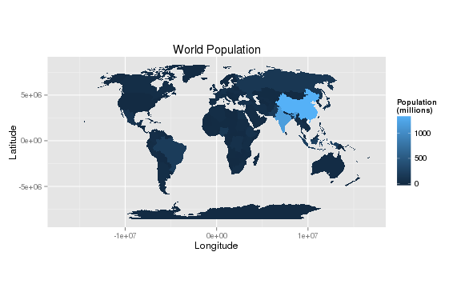
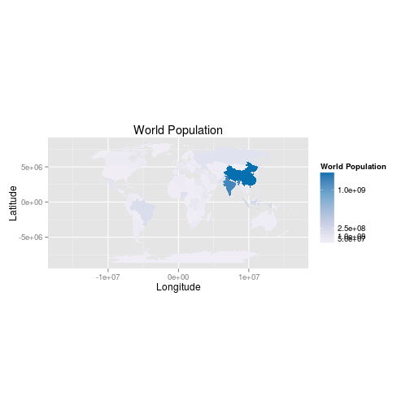
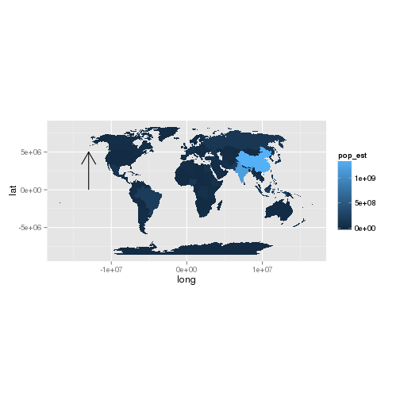
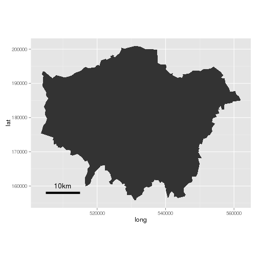
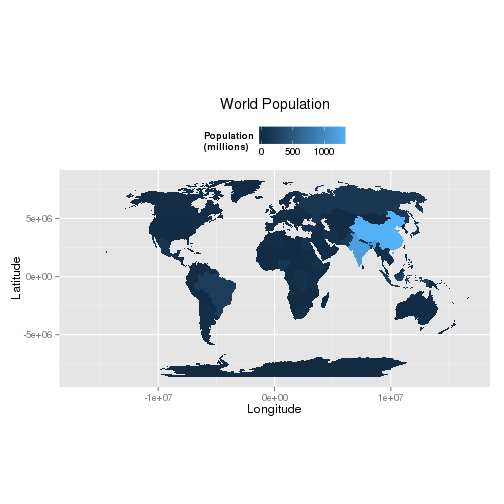
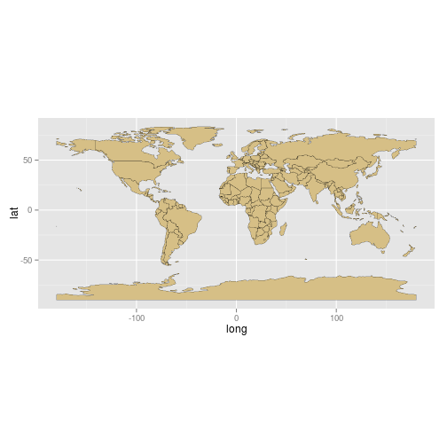

Introduction
============

What is R?
----------

R is a free and open source computer program that runs on all major
operating systems. It relies primarily on the *command line* for data
input: instead of interacting with the program by clicking on different
parts of the screen, so users enter commands via the keyboard. This will
seem to strange to people accustomed to relying on a graphical user
interface (GUI) for most of their computing, yet the approach has a
number of benefits, as highlighted by Gary Sherman (2008, p. 283),
developer of the popular Geographical Information System (GIS) QGIS:

> With the advent of “modern” GIS software, most people want to point
> and click their way through life. That’s good, but there is a
> tremendous amount of flexibility and power waiting for you with the
> command line. Many times you can do something on the command line in a
> fraction of the time you can do it with a GUI.

The joy of this, when you get accustomed to it, is that any command is
only ever a few keystrokes away, and the order of the commands sent to R
can be stored and repeated in scripts, saving time in the long-term and
ensuring reproducible results (see "R and reproducible research").

Another important attribute of R, related to its command line interface,
is that it is a fully fledged *programming language*. Other GIS programs
are written in lower level languages such as C++ which are kept at a
safe distance from the users by the GUI. In R, by contrast, the user
inputs is the same as what R sees when it processes the request. Access
to R's source code and openness about how it works has enabled a
veritable army of programmers to improve R over time and add an
incredible number of extensions to its capabilities. There are now more
than 4000 official packages for R, allowing it to tackle almost any
computational or numerical problem one could imagine.

Although writing R source code and creating new packages will not appeal
to most R users, it inspires confidence to know that there is a strong
and highly skilled community of R developers. If there is a useful
function that R cannot currently perform, there is a reasonable chance
that someone is working on a solution that will become available at a
later date. One area where extension of R's basic capabilities has been
particularly successful is the addition of a wide variety of spatial
tools.

Why R for spatial data visualisation?
-------------------------------------

Aside from confusion surrounding its one character name [1] and
uncertainty about how to search for help [2], R may also seem a strange
choice for a chapter on *spatial* data visualisation specifically. "I
thought R was just for statistics?" and "Why not use a proper GIS
package like ArcGIS?" are valid questions.

R was conceived - and is still primarily known - for its capabilities as
a "statistical programming language" (Bivand and Gebhardt 2000).
Statistical analysis functions remain core to the package but there is a
broadening of functionality to reflect a growing user base across
disciplines. R has become "an integrated suite of software facilities
for data manipulation, calculation and graphical display" (Venables et
al. 2013). Spatial data analysis and visualisation is an important
growth area within this increased functionality. In recent years R has
really made its mark as a data visualisation tool. The map of Facebook
friendships produced by Paul Butler is iconic in this regard, and
reached a global audience. He mapped the linkages between friends by
calculating the great circle arcs between them (using the `geosphere`
package) and plotted the result, displayed in figure 1. The secret to
the success of this map was the time taken to select the appropriate
colour palette, line widths and transparency for the plot. As we discuss
in Section 3 the importance of these cannot be understated and are the
difference between a stunning graphic and an impenetrable mess.

The impact of the graphic was to inspire the R community to produce more
ambitious graphics; a process fuelled by the increased demand for data
visualisation and the development of sophisticated packages, such as
ggplot2, that augment the basic plot functions of R. It is now the case
that R has become a key analysis and visualisation tool used by the
likes of Twitter, the New York Times and Facebook and thousands of
consultants, design houses and journalists. It is not longer the
preserve of academic research, with many graduate jobs listing R as a
desirable skill.

Finally, it is worth noting that while dedicated GIS programs handle
spatial data by default and display the results in a single way, there
are various options in R that must be decided by the user, for example
whether to use R's base graphics or a dedicated graphics package such as
ggplot2. On the other hand, the main benefits of R for spatial data
visualisation lie in the *reproducibility* of its outputs, a feature
that we will be using to great effect in this chapter.

### R and reproducible research

There is a drive towards transparency in data and methods datasets in
academic publishing. R encourages truly transparent and reproducible
research by enabling anyone with an R installation reproduce results
described in a previous paper. This process is eased by the RStudio
integrated development environment (IDE) that allows 'live' R code and
results to be embedded in documents. In fact, this chapter was written
in RStudio and can be recompiled on any computer by downloading the
project's GitHub repository.

Getting started with the chapter
--------------------------------

If you would like to work through the example code and data presented in
this chapter, the first stage, as with most GIS projects, is to obtain
and store the data. In this case, all the data has been uploaded to
GitHub, an on-line code sharing website:
[github.com/geocomPP/sdvwR](https://github.com/geocomPP/sdvwR). Upon
visiting this page, click on the "Download ZIP" button on the right, and
unpack the folder to a sensible place on your computer (e.g. the
Desktop). Explore the folder and try opening some of the files,
especially those from the sub-folder entitled "data": these are the
input datasets we'll be using.

R and Spatial Data
==================

Preliminaries
-------------

R has a unique syntax that is worth learning in basic terms before
loading spatial data: to R spatial and non-spatial data are treated in
the same way, although they have different underlying data structures.

The first step is to ensure that you are in the correct working
directory. Use `setwd` to select the correct folder. Assuming the folder
has been downloaded from GitHub and unpacked into the desktop on a
Windows computer, you would type the following:

~~~~ {.r}
setwd("C:/Users/Uname/Desktop/sdvwR-master")
~~~~

In RStudio, it is recommended to work from *script files*. To open a new
R script, click `File > New File` (see the [RStudio
website](http://www.rstudio.com/ide/docs/using/keyboard_shortcuts) for
shortcuts.) Try typing and running (by pressing `ctl-Enter` in an
RStudio script) the following calculations to see how R works and plot
the result.

~~~~ {.r}
t <- seq(from = 0, to = 20, by = 0.1)
x <- sin(t) * exp(-0.2 * t)
plot(t, x)
~~~~

R code consists of *functions*, usually proceeded by brackets (e.g.
`seq`) and *objects* (`d`, `t` and `x`). Each function contains
*arguments*, the names of which often do not need to be stated: the
function `seq(0, 20, 0.1)`, for example, would also work because `from`,
`to` and `by` are the *default* arguments. Knowing this is important as
it can save typing. In this chapter, however, we generally spell out
each of the argument names, for clarity.

Note the use of the assignment arrow `<-` to create new objects. Objects
are entities that can be called to by name in R and can be renamed
through additional assignements (e.g `y <- x` if y seems a more
appropriate name). This is an efficient way of referring to large data
objects or sets of commands.

Spatial Data in R
-----------------

In any data analysis project, spatial or otherwise, it is important to
have a strong understanding of the dataset before progressing. This
section will therefore begin with a description of the input data. We
will see how data can be loaded into R and exported to other formats,
before going into more detail about the underlying structure of spatial
data in R.

### Loading spatial data in R

In most situations, the starting point of a spatial analysis project is
to load in the datasets. These may originate from government agencies,
remote sensing devices or 'volunteered geographical information'
(Goodchild 2007). R is able to import a very wide range of spatial data
formats thanks to its interface with the Geospatial Data Abstraction
Library (GDAL), which is enabled by the package `rgdal`. Below we will
install the rgdal package using the function `install.packages` (this
can be used to install any packages) and then load data from two spatial
data formats: GPS eXchange (`.gpx`) and ESRI's Shapefile.

`readOGR` is in fact capable of loading dozens more file formats, so the
focus is on the *method* rather than the specific formats. Let's start
with a `.gpx` file, a tracklog recording a bicycle ride from Sheffield
to Wakefield uploaded OpenStreetMap [3].

~~~~ {.r}
install.packages("rgdal")
library(rgdal)  # load the gdal package
ogrListLayers(dsn = "data/gps-trace.gpx")
shf2lds <- readOGR(dsn = "data/gps-trace.gpx", layer = "tracks")  # load track
plot(shf2lds)
shf2lds.p <- readOGR(dsn = "data/gps-trace.gpx", layer = "track_points")  # load points
points(shf2lds.p[seq(1, 3000, 100), ])
~~~~

    ## Error: plot.new has not been called yet

    ## Error: plot.new has not been called yet

In the code above we first used R to *download* a file from the
internet, using the function `download.file` (note this has been
*commented out* using the `#` symbol). The two essential arguments of
this function are `url` (we could have typed `url =` before the link)
and `destfile`, the destination file. As with any function, more
optional arguments can be viewed by by typing `?download.file`.

When `rgdal` has successfully loaded, the next task is not to import the
file directly, but to find out which *layers* are available to import,
with `ogrListLayers`. The output from this command tells us that various
layers are available, including `tracks` and `track_points`. These are
imported into R's *workspace* using `readOGR`.

Finally, the basic `plot` function is used to visualize the newly
imported objects, ensuring they make sense. In the second plot function
(`points`), we add points for a subset of the object. There will be no
axes in the plot; to see how to add them, enter `?axis`

Try discovering more about the function by typing `?readOGR`. The
documentation explains that the `dsn =` argument is interpreted
differently depending on the type of file used. In the above example,
the `dsn` was set to as the name of the file. To load Shapefiles, by
contrast, the *folder* containing the data is used:

~~~~ {.r}
lnd <- readOGR(dsn = "data/", "london_sport")
~~~~

Here, the files reside in a folder entitled `data`, which is in R's
current working directory (you can check this using `getwd()`). If the
files were stored in the working directory, one would use `dsn = "."`
instead. Again, it may be wise to plot the data that results, to ensure
that it has worked correctly. Now that the data has been loaded into R's
own `sp` format, try interrogating and plotting it, using functions such
as `summary` and `plot`.

The london\_sport file contains data pertaining to the percentage of
people within each London Borough who regularly undertake physical
activity and also the 2001 population of each borough.

Both of the datasets we have loaded so far are relatively small. But
spatial data can get very large indeed. It is thus useful to understand
how 'large' the object you are dealing with is, and know how to reduce
unnecessary complexity in its *geometry* to make it more manageable to
analyse, plot and store. Fortunately, R makes this easy, with the
commands `object.size` and `gSimplify`. For more information on these
useful commands, readers are referred to an [on-line
vignette](http://rpubs.com/RobinLovelace/11962) based on the `lnd` and
`shf2lds` objects we have just loaded. For now, let us continue with an
even more important topic: how R 'sees' spatial data.

### The structure of spatial data in R

Spatial datasets in R are saved in their own format, defined as
`Spatial...` classes within the `sp` package. For this reason, `sp` is
the basic spatial package in R, upon which the others depend. Spatial
classes range from the basic `Spatial` class to the complex
`SpatialPolygonsDataFrame`: the `Spatial` class contains only two
required *slots* [5]:

~~~~ {.r}
getSlots("Spatial")
~~~~

    ##        bbox proj4string 
    ##    "matrix"       "CRS"

This tells us that `Spatial` objects must contain a bounding box
(`bbox`) and a coordinate reference system (CRS) accessed via the
function `proj4string`. Further details on these can be found by typing
`?bbox` and `?proj4string`. All other spatial classes in R build on this
foundation of a bounding box and a projection system (which is set
automatically to `NA` if it is not known). However, more complex classes
contain more slots, some of which are lists which contain additional
lists. To find out the slots of `shf2lds.simple`, for example, we would
first ascertain its class and then use the `getSlots` command:

~~~~ {.r}
class(shf2lds.simple)  # identify the object's class
~~~~

    ## Error: object 'shf2lds.simple' not found

~~~~ {.r}
getSlots("SpatialLinesDataFrame")  # find the associated slots
~~~~

    ##         data        lines         bbox  proj4string 
    ## "data.frame"       "list"     "matrix"        "CRS"

The same principles apply to all spatial classes including
`Spatial* Points`, `Polygons` `Grids` and `Pixels` as well as associated
`*DataFrame` classes. For more information on this, see the `sp`
documentation: `?Spatial`.

To flatten a `Spatial*` object in R, so it becomes a simple data frame,
the `fortify` function can be used (more on this later). For most
spatial data handling tasks the `Spatial*` object classes are idea, as
illustrated below.

### Saving and exporting spatial objects

A typical R workflow involves loading the data, processing/analysing the
data and finally exporting the data in a new form. `writeOGR`, the
logical counterpart of `readOGR` is ideal for this task. This is
performed using the following command (in this case we are exporting to
an ESRI Shapefile):

~~~~ {.r}
shf2lds.simple <- SpatialLinesDataFrame(shf2lds.simple, data.frame(row.names = "0", 
    a = 1))
~~~~

    ## Error: object 'shf2lds.simple' not found

~~~~ {.r}
writeOGR(shf2lds.simple, layer = "shf2lds", dsn = "data/", driver = "ESRI Shapefile")
~~~~

    ## Error: object 'shf2lds.simple' not found

In the above code, the object was first converted into a spatial
dataframe class required by the `writeOGR` command, before being
exported as a shapefile entitled shf2lds. Unlike with `readOGR`, the
driver must be specified, in this case with "ESRI Shapefile" [4]. The
simplified GPS data are now available to other GIS programs for further
analysis. Alternatively,
`save(shf2lds.simple, file = "data/shf2lds.RData")` will save the object
in R's own spatial data format.

### Attribute joins

London Boroughs are official administrative zones so we can easily join
a range of other datasets to the polygons in the `lnd` object. We will
use the example of crime data to illustrate this data availability,
which is stored in the `data` folder available from this project's
github page.

~~~~ {.r}
load("data/crimeAg.Rdata")  # load the crime dataset from an R dataset
~~~~

After the dataset has been explored (e.g. using the `summary` and `head`
functions) to ensure compatibility, it can be joined to `lnd`. We will
use the the `join` function in the `plyr` package but the `merge`
function could equally be used (remember to type `library(plyr)` if
needed).

`join` requires all joining variables to have the same name, which has
already been done [7].

~~~~ {.r}
lnd@data <- join(lnd@data, crimeAg)
~~~~

Take a look at the `lnd@data` object. You should see new variables
added, meaning the attribute join was successful.

Summary
-------

To summarise this section, we have learned how to perform the crucial
tasks of loading and saving spatial datasets in R. This should have been
surprisingly painless considering the dread surrounding some
command-line programs (watch out for typos!). We have also taken a look
inside R's representation of spatial data, learned how to manipulate
these datasets with a simple attribute join. Much more complex
procedures are possible, but for now we will move on to visualisation.

Fundamentals of Spatial Data Visualisation
==========================================

Good maps depend on sound analysis and can have an enormous impact on
the understanding and communication of results. It has never been easier
to produce a map. The underlying data required are available in
unprecedented volumes and the technological capabilities of transforming
them into compelling maps and graphics are increasingly sophisticated
and straightforward to use. Data and software, however, only offer the
starting points of good spatial data visualisation since they need to be
refined and calibrated by the researchers seeking to communicate their
findings. In this section we will run through the features of a good
map. It is worth noting that not all good maps and graphics contain all
the features below – they should simply be seen as suggestions rather
than firm principles.

Effective map making is hard process – as Krygier and Wood (2011) put it
"there is a lot to see, think about, and do" (p6). It often comes at the
end of a period of intense data analysis and perhaps when the priority
is to get a paper finished or results published and can therefore be
rushed as a result. The beauty of R (and other scripting languages) is
the ability to save code and simply re-run it with different data.
Colours, map adornments and other parameters can therefore be quickly
applied, so it is well worth creating a template script that adheres to
best practice.

We have selected ggplot2 as our package of choice for the bulk of our
maps and spatial data visualisations because it has a number of these
elements at its core. The "gg" in its slightly odd name stands for
"Grammar of Graphics", which is a set of rules developed by Leland
Wilkinson (2005) in a book of the same name. Grammar in the context of
graphics works in much the same way as it does in language - it provides
a structure. The structure is informed by both human perception and also
mathematics to ensure that the resulting visualisations are both
technically sound and comprehensible. By creating ggplot2, Hadley
Wickham, implemented these rules as well as developing ways in which
plots can be built up in layers (see Wickham, 2010). This layering
component is especially useful in the context of spatial data since it
is conceptually the same as map layers in Geographical Information
Systems (GIS).

First ensure that the necessary packages are installed and that R is in
the correct working directory (see above). Then load the packages used
in this section.

~~~~ {.r}
library(rgdal)
library(ggplot2)
library(gridExtra)
~~~~

We are going to use a map of the world to demonstrate some of the
cartographic principles as they are introduced. The world map used is
available from the Natural Earth website. Because these are already
saved in the data folder, we can proceed to load the data.

~~~~ {.r}
wrld <- readOGR("data/", "ne_110m_admin_0_countries")
~~~~

    ## OGR data source with driver: ESRI Shapefile 
    ## Source: "data/", layer: "ne_110m_admin_0_countries"
    ## with 177 features and 63 fields
    ## Feature type: wkbPolygon with 2 dimensions

~~~~ {.r}
plot(wrld)
~~~~

Let's see a sample of the attribute data and remove the Falklands and
French Southern and Antarctic Lands (to demonstrate the method - type
`?regex` if interested how this works - and because these countries
cause continent mis-assignment later on):

~~~~ {.r}
head(wrld@data)[1:3, 1:5]
~~~~

    ##   scalerank      featurecla labelrank  sovereignt sov_a3
    ## 0         1 Admin-0 country         3 Afghanistan    AFG
    ## 1         1 Admin-0 country         3      Angola    AGO
    ## 2         1 Admin-0 country         6     Albania    ALB

~~~~ {.r}
wrld <- wrld[!grepl("Falk|French Southern", wrld$name_long), ]
~~~~

You can see there are a lot of columns associated with this file.
Although we will keep all of them, we are only really interested in the
population estimate ("pop\_est") field. Before progressing it is is
worth reprojecting the data in order that the population data can be
seen better. The coordinate reference system of the wrld shapefile is
currently WGS84. This is the common latitude and longitude format that
all spatial software packages understand. From a cartographic
perspective the standard plots of this projection, of the kind produced
above, are not suitable since they heavily distort the shapes of those
countries further from the equator. Instead the Robinson projection
provides a good compromise between areal distortion and shape
preservation. We therefore project it as follows.

~~~~ {.r}
wrld.rob <- spTransform(wrld, CRS("+proj=robin"))
plot(wrld.rob)
~~~~

`+proj=robin` refers to the Robinson projection. You will have spotted
from the plot that the countries in the world map are much better
proportioned.

We now need to `fortify` this spatial data to convert it into a format
that ggplot2 understands, we also use `merge` to re-attach the attribute
data that is lost in the fortify operation.

~~~~ {.r}
wrld.rob.f <- fortify(wrld.rob, region = "sov_a3")
~~~~

    ## Loading required package: rgeos
    ## rgeos version: 0.3-2, (SVN revision 413M)
    ##  GEOS runtime version: 3.3.8-CAPI-1.7.8 
    ##  Polygon checking: TRUE

~~~~ {.r}

wrld.pop.f <- merge(wrld.rob.f, wrld.rob@data, by.x = "id", by.y = "sov_a3")
~~~~

The code below produces a map coloured by the population variable. It
demonstrates the sophistication of ggplot2 by first stringing together a
series of plot commands and assigning them to a single R object called
`map`. If you type `map` into the command line, R will then execute the
code and generate the plot. By simple specifing our `fill` variable
within the `aes()` part of the code and then using the `geom_polygon()`
command ggplot2 will fill colour the countries using a default colour
pallette and auto-generated key. As will be shown in the next section
these defaults can be easily altered to produce different looking maps.

~~~~ {.r}
map <- ggplot(wrld.pop.f, aes(long, lat, group = group, fill = pop_est)) + geom_polygon() + 
    coord_equal() + labs(x = "Longitude", y = "Latitude", fill = "World Population") + 
    ggtitle("World Population")

map
~~~~

Colour and other aesthetics
---------------------------

Colour has an enormous impact on how people will percieve a graphic.
Readers of a map come to it with a range of pre-conceptions about how
the world looks.

### Choropleth Maps

ggplot2 knows the different between continuous and categorical (nominal)
data and will automatically assign the appropriate colour palettes when
producing choropleth maps such as the one above. The default colour
palettes are generally a good place to start but users may wish to vary
them for a whole host of reasons, such as the need to print in black and
white. The `scale_fill_` family of commands facilitate such
customisation. For categorical data `scale_fill_manual()` is a useful
command:

~~~~ {.r}
# Produce a map of continents
map.cont <- ggplot(wrld.pop.f, aes(long, lat, group = group, fill = continent)) + 
    geom_polygon() + coord_equal() + labs(x = "Longitude", y = "Latitude", fill = "World Continents") + 
    ggtitle("World Continents")

# To see the default colours
map.cont
~~~~

To change the colour scheme:

~~~~ {.r}
map.cont + scale_fill_manual(values = c("yellow", "red", "purple", "white", 
    "orange", "blue", "green", "black"))
~~~~

Whilst `scale_fill_continuous()` works with continuous datasets:

~~~~ {.r}
# note the use of the 'map' object created earler

map + scale_fill_continuous(low = "white", high = "black")
~~~~

It is well worth looking at the *Color Brewer* palettes developed by
Cynthia Brewer. These are designed to be colour blind safe and
perceptually uniform such that no one colour jumps out more than any
others. This latter characteristic is important when trying to produce
impartial maps. R has a package that contains the colour palettes and
these can be easily utlised by ggplot2.

~~~~ {.r}
library(RColorBrewer)
# look at the help documents to see the palettes available. See
# http://colorbrewer2.org/
`?`(RColorBrewer)
# note the use of the scale_fill_gradientn() function rather than
# scale_fill_continuous() used above
map + scale_fill_gradientn(colours = brewer.pal(7, "YlGn"))
~~~~

In addition to altering the colour scale used to represent continuous
data it may also be desirable to adjust the breaks at which the colour
transitions occur. There are many ways to select both the optimum number
of breaks (i.e colour transtions) and the locations in the dataset at
which they occur. The `classINT` package contains many ways to
automatically create these breaks. We use the `grid.arrange` function
from the gridExtra package to display the maps side by side.

~~~~ {.r}
library(classInt)

# Specify how many breaks you want - generally this should be fewer than 7.

nbrks <- 6

# Here quantiles are used to identify the breaks (note that we are using the
# original 'wrld.rob' object and not the 'wrld.rob@data$pop_est.f'). USe the
# help files to see the full range of options.
brks <- classIntervals(wrld.rob@data$pop_est, n = nbrks, style = "quantile")

print(brks)
~~~~

    ## style: quantile
    ##        [-99,1990876)    [1990876,4615807)    [4615807,9059651) 
    ##                   29                   29                   29 
    ##   [9059651,16715999)  [16715999,40913584) [40913584,1.339e+09] 
    ##                   29                   29                   30

~~~~ {.r}

# Now the breaks can be easily inserted into the code above for a range of
# colour palettes
YlGn <- map + scale_fill_gradientn(colours = brewer.pal(nbrks, "YlGn"), breaks = c(brks$brks))

PuBu <- map + scale_fill_gradientn(colours = brewer.pal(nbrks, "PuBu"), breaks = c(brks$brks))

grid.arrange(YlGn, PuBu, ncol = 2)
~~~~

If you are not happy with the automatic methods of specifying breaks it
can also be done manually:

~~~~ {.r}
library()
nbrks <- 4
brks <- c(1e+08, 2.5e+08, 5e+07, 1e+09)
map + scale_fill_gradientn(colours = brewer.pal(nbrks, "PuBu"), breaks = c(brks))
~~~~

There are many other ways to specify and alter the colours in ggplot2
and these are outlined in the help documentation. There are also many
examples online.

If the map's purpose is to clearly communicate data then it is often
advisable to conform to conventions so as not to disorientate readers to
ensure they can focus on the key messages contained in the data. A good
example of this is the use of blue for bodies of water and green for
landmasses. The code example below generates two plots with our
wrld.pop.f object. The first colours the land blue and the sea (in this
case the background to the map) green and the second is more
conventional.

~~~~ {.r}
map2 <- ggplot(wrld.pop.f, aes(long, lat, group = group)) + coord_equal()

blue <- map2 + geom_polygon(fill = "light blue") + theme(panel.background = element_rect(fill = "dark green"))

green <- map2 + geom_polygon(fill = "dark green") + theme(panel.background = element_rect(fill = "light blue"))

grid.arrange(blue, green, ncol = 2)
~~~~

### Experimenting with line colour and line widths

In addition to conforming to colour conventions, line colour and width
offer important parameters, which are often overlooked tools for
increasing the legibility of a graphic. As the code below demonstrates,
it is possible to adjust line colour through using the `colour`
parameter and the line width using the `lwd` parameter. The impact of
different line widths will vary depending on your screen size and
resolution. If you save the plot to pdf (or an image) then the size at
which you do this will also affect the line widths.

~~~~ {.r}
map3 <- map2 + theme(panel.background = element_rect(fill = "light blue"))

yellow <- map3 + geom_polygon(fill = "dark green", colour = "yellow")

black <- map3 + geom_polygon(fill = "dark green", colour = "black")

thin <- map3 + geom_polygon(fill = "dark green", colour = "black", lwd = 0.1)

thick <- map3 + geom_polygon(fill = "dark green", colour = "black", lwd = 1.5)

grid.arrange(yellow, black, thick, thin, ncol = 2)
~~~~

There are other parameters such as layer transparency (use the `alpha`
parameter for this) that can be applied to all aspects of the plot -
both points, lines and polygons. Space does not permit their full
exploration here but more information is available from the many online
examples and the ggplot2 package documentation.

Map Adornments and Annotations
------------------------------

Map adornments and annotations are essential to orientate the viewer and
provide context; they include graticules, north arrows, scale bars and
data attribution. Not all are required on a single map, indeed it is
often best that they are used sparingly to avoid unecessary clutter
(Monkhouse and Wilkinson, 1971). With ggplot2 many of these are added
automatically but they can be customised.

### North arrow

In the maps created so far, we have defined the *aesthetics* of the map
in the foundation function ggplot. The result of this is that all
subsequent layers are expected to have the same variables and
essentially contain data with the same dimensions as original dataset.
But what if we want to add a new layer from a completely different
dataset, e.g. to add an arrow? To do this, we must not add any arguments
to the `ggplot` function, only adding data sources one layer at a time:

Here we create an empty plot, meaning that each new layer must be given
its own dataset. While more code is needed in this example, it enables
much greater flexibility with regards to what can be included in new
layer contents. Another possibility is to use `geom_segment()` to add a
rudimentary arrow (see `?geom_segment` for refinements):

~~~~ {.r}
library(grid)  # needed for arrow
ggplot() + geom_polygon(data = wrld.pop.f, aes(long, lat, group = group, fill = pop_est)) + 
    geom_line(aes(x = c(-1.3e+07, -1.3e+07), y = c(0, 5e+06)), arrow = arrow()) + 
    coord_fixed()  # correct aspect ratio
~~~~

### Scale bar

ggplot2's scale bar capabilities are perhaps the least satisfactory
element of the package. For this example we use the `geom_line()`
function to draw a line of approximately 1km in length using the `lnd.f`
object containing the London Boroughs discussed in Section 2. The reason
for this is that it is in a projected coordinate system - British
National Grid - so each map unit is worth 1m. In the case of the world
map the distances at the equator in terms of degrees east to west are
very different from those further north or south. Any line drawn using
the the simple approach below would therefore be inaccurate. For maps
covering large areas - such as the entire world - leaving the axis
labels on will enable them to act as a graticule which will indicate
distance.

~~~~ {.r}
load("data/lnd.f.RData")
ggplot() + geom_polygon(data = lnd.f, aes(long, lat, group = group)) + geom_line(aes(x = c(505000, 
    515000), y = c(158000, 158000)), lwd = 2) + annotate("text", label = "10km", 
    x = 510000, y = 160000) + coord_fixed()
~~~~

### Legends

Legends are added automatically but can be customised in a number of
ways. A few examples are included below with more details avaialble in
the `ggplot2` documentation.

~~~~ {.r}
# Position
map + theme(legend.position = "top")
~~~~

As you can see, this added the legend in a new place. Many more options
for customization are available, as highlighed in the examples below.

~~~~ {.r}
# Title
map + theme(legend.title = element_text(colour = "Red", size = 16, face = "bold"))

# Label Font Size and Colour
map + theme(legend.text = element_text(colour = "blue", size = 16, face = "italic"))

# Border and background box
map + theme(legend.background = element_rect(fill = "gray90", size = 0.5, linetype = "dotted"))
~~~~

Adding Basemaps To Your Plots
-----------------------------

The development of the ggmap package has enabled the simple use of
online mapping services such as Google Maps and OpenStreetMap for base
maps. Using image tiles from these services spatial data can be placed
in context as users can easily orientate themselves to streets and
landmarks.

For this example we are going to use the shapefile of London sports
participation introduced in Section 2. The data were originally
projected to British National Grid (BNG) which is not compatible with
the online map services used in the following examples. It therefore
needs reprojecting - a step we completed earlier. The reprojected file
can be loaded as follows:

~~~~ {.r}
load("data/lnd.wgs84.RData")
~~~~

The first job is to calculate the bounding box (bb for short) of the
`lnd.wgs84` object to identify the geographic extent of the map. This
information is used to request the appropriate map tiles from the map
service of our choice. This process is conceptually the same as the size
of your web browser or smartphone screen when using Google maps for
navigation. The first line of code in the snippet below retrieves the
bounding box and the two that follow add 5% so there is a little space
around the edges of the data to be plotted.

~~~~ {.r}
b <- bbox(lnd.wgs84)
b[1, ] <- (b[1, ] - mean(b[1, ])) * 1.05 + mean(b[1, ])
b[2, ] <- (b[2, ] - mean(b[2, ])) * 1.05 + mean(b[2, ])
# scale longitude and latitude (increase bb by 5% for plot) replace 1.05
# with 1.xx for an xx% increase in the plot size
~~~~

This is then fed into the `get_map` function as the location parameter.
The syntax below contains 2 functions. `ggmap` is required to produce
the plot and provides the base map data.

~~~~ {.r}
library(ggmap)

lnd.b1 <- ggmap(get_map(location = b))
~~~~

    ## Warning: bounding box given to google - spatial extent only approximate.

`ggmap` follows the same syntax structures as ggplot2 and so can easily
be integrated with the other examples included here. First `fortify` the
`lnd.wgs84` object and then merge with the required attribute data.

~~~~ {.r}
lnd.wgs84.f <- fortify(lnd.wgs84, region = "ons_label")
lnd.wgs84.f <- merge(lnd.wgs84.f, lnd.wgs84@data, by.x = "id", by.y = "ons_label")
~~~~

We can now overlay this on our base map using the `geom_polygon()`
function.

~~~~ {.r}
lnd.b1 + geom_polygon(data = lnd.wgs84.f, aes(x = long, y = lat, group = group, 
    fill = Partic_Per), alpha = 0.5)
~~~~

The resulting map looks reasonable, but it would be improved with a
simpler base map in black and white. A design firm called *stamen*
provide the tiles we need and they can be brought into the plot with the
`get_map` function:

~~~~ {.r}
lnd.b2 <- ggmap(get_map(location = b, source = "stamen", maptype = "toner", 
    crop = T))  #note the addition of the maptype parameter.
~~~~

We can then produce the plot as before.

~~~~ {.r}
lnd.b2 + geom_polygon(data = lnd.wgs84.f, aes(x = long, y = lat, group = group, 
    fill = Partic_Per), alpha = 0.5)
~~~~

Finally, if we want to increase the detail of the base map, `get_map`
has a zoom parameter.

~~~~ {.r}
lnd.b3 <- ggmap(get_map(location = b, source = "stamen", maptype = "toner", 
    crop = T, zoom = 11))

lnd.b3 + geom_polygon(data = lnd.wgs84.f, aes(x = long, y = lat, group = group, 
    fill = Partic_Per), alpha = 0.5)
~~~~

Spatial polygons are not the only data types compatible with `ggmap` -
you can use any plot type and set of parameters available in `ggplot2`,
making it an ideal companion package for spatial data visualisation.

Summary
-------

There are an almost infinite number of different combinations colours,
adornments and line widths that could be applied to a map, so take
inspiration from maps and graphics you have seen and liked. The process
is an iterative one, it will take multiple attempts to get right. Show
your map to friends and colleagues - all will have an opinion but don’t
be afraid to stand by the decisions you have taken. To give your maps a
final polish you may wish to export them as a pdf using the `ggsave()`
function and importing them into a vector graphics package such as Adobe
Illustrator or Inkscape.

The beauty of producing maps in a programming environment as opposed to
the GUI offered by the majority of GIS software packages lies in the
fact that each line of code can be easily adapted to a different
dataset. Users can therefore create a series of scripts that act as
templates and simply call them when required. This saves a huge amount
of time and has the added advantage that all outputs will have a
consistent style and thus offer more professional looking publications.

A Final Example
===============

Here we present a final example that draws upon the many advanced
concepts discussed in this chapter to produce a map of 18th Century
Shipping flows. The data have been obtained from the CLIWOC project and
they represent a sample of digitised ships' logs from the 18th Century.
We are using a very small sample of the the full dataset, which is
available from here: http://pendientedemigracion.ucm.es/info/cliwoc/.
The example has been chosen to demonstrate a range of capabilities
within ggplot2 and the ways in which they can be applied to produce
high-quality maps with only a few lines of code. We end by showing how
the maps can be animated to chart the routes over time and the ability
of R to produce many maps very quickly.

As always, the first step is to load in the required packages and
datasets. Here we are using the png package to load in a series of map
annotations. These have been created in image editing software and will
add a historic feel to the map. We are also loading in a World boundary
shapefile and the shipping data itself.

~~~~ {.r}
library(rgdal)
library(ggplot2)
library(png)
wrld <- readOGR("data/", "ne_110m_admin_0_countries")
~~~~

    ## OGR data source with driver: ESRI Shapefile 
    ## Source: "data/", layer: "ne_110m_admin_0_countries"
    ## with 177 features and 63 fields
    ## Feature type: wkbPolygon with 2 dimensions

~~~~ {.r}
btitle <- readPNG("figure/brit_titles.png")
compass <- readPNG("figure/windrose.png")
~~~~

    ## Error: unable to open figure/windrose.png

~~~~ {.r}
bdata <- read.csv("data/british_shipping_example.csv")
~~~~

If you look at the first few lines in the `bdata` object you will see
there are 7 columns with each row representing a single point on the
ships course. The year of the journey and the nationality of the ship
are also included. The final 3 columns are identifiers that are used
later to group the coordinate points together into the paths that
ggplot2 plots.

We first specify some plot parameters that remove the axis labels.

~~~~ {.r}
xquiet <- scale_x_continuous("", breaks = NULL)
yquiet <- scale_y_continuous("", breaks = NULL)
quiet <- list(xquiet, yquiet)
~~~~

The next step is to `fortify` the World coastlines and create the base
plot. This sets the extents of the plot window and provides the blank
canvas on which we will build up the layers. The first layer created is
the wrld object; the code is wrapped in `c()` to prevent it from
executing by simply storing it as the plot's parameters.

~~~~ {.r}
wrld.f <- fortify(wrld, region = "sov_a3")
base <- ggplot(wrld.f, aes(x = long, y = lat))
wrld <- c(geom_polygon(aes(group = group), size = 0.1, colour = "black", fill = "#D6BF86", 
    data = wrld.f, alpha = 1))
~~~~

To see the result of this simply type:

~~~~ {.r}
base + wrld
~~~~

The code snipped below creates the plot layer containing the the
shipping routes. The `geom_path()` function is used to string together
the coordinates into the routes. You can see within the `aes()`
component we have specified long and lat plus pasted together the trp
and `group.regroup` variables to identify the unique paths.

~~~~ {.r}
route <- c(geom_path(aes(long, lat, group = paste(bdata$trp, bdata$group.regroup, 
    sep = ".")), colour = "#0F3B5F", size = 0.2, data = bdata, alpha = 0.5, 
    lineend = "round"))
~~~~

We now have all we need to generate the final plot by building the
layers together with the `+` sign as shown in the code below. The first
3 arguments are the plot layers, and the parameters within `theme()` are
changing the background colour to sea blue. `annotation_raster()` plots
the png map adornments loaded in earlier- this requires the bounding box
of each image to be specified. In this case we use latitude and
longitude (in WGS84) and we can use these paramrters to change the png's
position and also its size. The final two arguments fix the aspect ratio
of the plot and remove the axis labels.

~~~~ {.r}
base + route + wrld + theme(panel.background = element_rect(fill = "#BAC4B9", 
    colour = "black")) + annotation_raster(btitle, xmin = 30, xmax = 140, ymin = 51, 
    ymax = 87) + annotation_raster(compass, xmin = 65, xmax = 105, ymin = 25, 
    ymax = 65) + coord_equal() + quiet
~~~~

    ## Error: object 'compass' not found

In the plot example we have chosen the colours carefully to give the
appearance of a historic map. An alternative approach could be to use a
satellite image as a base map. It is possible to use the readPNG
function to import NASA's "Blue Marble" image for this purpose. Given
that the route information is the same projection as the image it is
very straightforward to set the image extent to span -180 to 180 degrees
and -90 to 90 degrees and have it align with the shipping data.
Producing the plot is accomplished using the code below. This offers a
good example of where functionality designed without spatial data in
mind can be harnessed for the purposes of producing interesting maps.
Once you have produced the plot, alter the code to recolour the shipping
routes to make them appear more clearly against the blue marble
background.

~~~~ {.r}
earth <- readPNG("figure/earth_raster.png")
~~~~

    ## Error: unable to open figure/earth_raster.png

~~~~ {.r}

base + annotation_raster(earth, xmin = -180, xmax = 180, ymin = -90, ymax = 90) + 
    route + theme(panel.background = element_rect(fill = "#BAC4B9", colour = "black")) + 
    annotation_raster(btitle, xmin = 30, xmax = 140, ymin = 51, ymax = 87) + 
    annotation_raster(compass, xmin = 65, xmax = 105, ymin = 25, ymax = 65) + 
    coord_equal() + quiet
~~~~

    ## Error: object 'earth' not found

Animating your plots
--------------------

R is not designed to produce animated graphics and as such it has very
few functions that enable straightforward animation. To produce animated
graphics users can use a loop to plot and then export a series of images
that can then be stitched together into a video. There are two
approaches to this; the first is to create a loop that fills a folder
with the desired images and then utilise third party software to stitch
the images together, whilst the second uses R's own animation package.
The latter option still requires the installation of an additional
software package called ImageMagick but it has the benefit of creating
the animation for you within R and faciliting the export to a range of
formats, not least HTML and GIF. Here we demonstrate the use of the
package to produce an HTML animation of the shipping tracks completed in
each year of the bdata object. The code snippet below appears extremely
dense, but it only contains a few addtions to the plot code utilised
above.

First load the package:

~~~~ {.r}
library(animation)
~~~~

Then clear any previous animation. Obviously the first time you run this
it is unnecessary, but it is a good habit to get into.

~~~~ {.r}
ani.record(reset = TRUE)
~~~~

We then initiate the "for loop". In this case we are using the
`unique()` function to list the unique years within the `bdata` object.
The loop will take the first year, in this case 1791, and assign it to
the object `i`. The code inside the `{}` brackets will then run with
`i=1791`. You will spot that `i` is used in a number of places- first to
subset the data when creating the route plot and then as the title in
the `ggtitle()` function. We need to force ggplot to create the graphic
within the loop so the entire plot call is wrapped in the `print()`
function. Once the plot is called `ani.record()` is used to save the
plot still and `dev.off()` used to clear the plot window ready for the
next iteration. `i` is then assigned the next year in the list and the
code runs again until all years are plotted.

~~~~ {.r}
for (i in unique(bdata$year)) {
    route <- c(geom_path(aes(long, lat, group = paste(trp, group.regroup, sep = ".")), 
        colour = "#0F3B5F", size = 0.2, data = bdata[which(bdata$year == i), 
            ], alpha = 0.5, lineend = "round"))
    print(base + route + wrld + theme(panel.background = element_rect(fill = "#BAC4B9", 
        colour = "black")) + annotation_raster(btitle, xmin = 30, xmax = 140, 
        ymin = 51, ymax = 87) + annotation_raster(compass, xmin = 65, xmax = 105, 
        ymin = 25, ymax = 65) + coord_equal() + quiet + ggtitle(i))
    ani.record()
    dev.off()
}
~~~~

The final step in the process is to save the animation to HTML and view
it in your web browser. `ani.replay()` retrieves the animation stored by
the `ani.record()` function and `outdir = getwd()` ensures the final
file is stored in your working directory.

~~~~ {.r}
saveHTML(ani.replay(), img.name = "record_plot", outdir = getwd())
~~~~

You will note that there is something a little odd about the order in
which the years appear. This can be solved by an additional step before
the loop code above. Have a think then add this in and then regenerate
the animation.

Recap and Conclusions
=====================

This chapter has covered a large number of techniques and approaches for
the preparation, analysis and visualisation of spatial data in R. Whilst
it only covers the tip of the iceberg in terms of R's capabilities, it
does lay the foundations to the use of the multitude of other spatial
data packages available. These can be discovered online and through the
help documentation and other chapters provided by the R community. By
utilising the data visualisation techniques and examples of best
practice we have covered it is hoped that you will be able to
communicate your results in a compelling and effective way without the
need for the repetitive "pointing and clicking" required of many GIS
packages; you can now tweak colours and other aspects of the plots
without the need to start from scratch each time an iterative
improvement is required. As the R community grows so will its range of
applications and available packages so there will be many exciting
opportunities ahead to improve on what is presented here.

Recap and Conclusions
=====================

This chapter has covered a large number of techniques and approaches for
the preparation, analysis and visualisation of spatial data in R. Whilst
it only covers the tip of the iceberg in terms of R's capabilities, it
does lay the foundations to the use of the multitude of other spatial
data packages available. These can be discovered online and through the
help documentation and other chapters provided by the R community. By
utilising the data visualisation techniques and examples of best
practice we have covered it is hoped that you will be able to
communicate your results in a compelling and effective way without the
need for the repetitive "pointing and clicking" required of many GIS
packages; you can now tweak colours and other aspects of the plots
without the need to start from scratch each time an iterative
improvement is required. As the R community grows so will its range of
applications and available packages so there will be many exciting
opportunities ahead to improve on what is presented here.

References
==========

Bivand, R., & Gebhardt, A. (2000). Implementing functions for spatial
statistical analysis using the R language. Journal of Geographical
Systems, 2(3), 307–317.

Bivand, R. S., Pebesma, E. J., & Rubio, V. G. (2013). Applied spatial
data: analysis with R. Springer.

Burrough, P. A. & McDonnell, R. A. (1998). Principals of Geographic
Information Systems (revised edition). Clarendon Press, Oxford.

Goodchild, M. F. (2007). Citizens as sensors: the world of volunteered
geography. GeoJournal, 69(4), 211–221.

Harris, R. (2012). A Short Introduction to R.
[social-statistics.org](http://www.social-statistics.org/).

Kabacoff, R. (2011). R in Action. Manning Publications Co.

Krygier, J. Wood, D. 2011. Making Maps: A Visual Guide to Map Design for
GIS (2nd Ed.). New York: The Guildford Press.

Longley, P., Goodchild, M. F., Maguire, D. J., & Rhind, D. W. (2005).
Geographic information systems and science. John Wiley & Sons.

Monkhouse, F.J. and Wilkinson, H. R. 1973. Maps and Diagrams Their
Compilation and Construction (3rd Edition, reprinted with revisions).
London: Methuen & Co Ltd.

Ramsey, P., & Dubovsky, D. (2013). Geospatial Software's Open Future.
GeoInformatics, 16(4).

Sherman, G. (2008). Desktop GIS: Mapping the Planet with Open Source
Tools. Pragmatic Bookshelf.

Torfs and Brauer (2012). A (very) short Introduction to R. The
Comprehensive R Archive Network.

Venables, W. N., Smith, D. M., & Team, R. D. C. (2013). An introduction
to R. The Comprehensive R Archive Network (CRAN). Retrieved from
http://cran.ma.imperial.ac.uk/doc/manuals/r-devel/R-intro.pdf .

Wickham, H. (2009). ggplot2: elegant graphics for data analysis.
Springer.

Wickham, H. 2010. A Layered Grammar of Graphics. American Statistical
Association, Institute of Mathematics Statistics and Interface
Foundation of North America Journal of Computational and Graphical
Statistics. 19, 1: 3-28

Endnotes
========

1.  "What kind of a name is R?" common question. R's name originates
    from the creators of R, Ross Ihaka and Robert Gentleman. R is an
    open source implementation of the statistical programming language
    S, so its name is also a play on words that makes implicit reference
    to this.

2.  R is notoriously difficult to search for on major search engines, as
    it is such a common letter with many other uses beyond the name of a
    statistical programming language. This should not be a deterrent, as
    R has a wealth of excellent online resources. To overcome the issue,
    you can either be more specific with the search term (e.g. "R
    spatial statistics") or use an R specific search engine such as
    [rseek.org](http://www.rseek.org/). You can also search of online
    help *from within R* using the command `RSiteSearch`. E.g.
    `RSiteSearch("spatial statistics")`. Experiment and see which you
    prefer!

3.  The file was downloaded using the following command:
    "download.file("http://www.openstreetmap.org/trace/1619756/data",
    destfile = "data/gps-trace.gpx")". More information about this ride,
    and a
    [video](http://www.youtube.com/watch?v=6a8QLiC4LV8&feature=share)
    from it, can be found on
    [robinlovelace.net](http://robinlovelace.net/ecotech/2013/10/13/bicycle-trailer-move.html).

4.  A complete list of drivers for importing and exporting spatial data
    can be displayed by typing `getGDALDriverNames()`.

5.  Slots are elements found 'inside' classes of the [S4 object
    system](http://adv-r.had.co.nz/S4.html). While the sub-elements of
    S3 objects such as `data.frame` are referred to using the `$`
    symbol, the slots of S4 objects are identified using `@`. Thus, the
    variable `x` of dataframe `df` can be referred to with `df$x`. In
    the same way, the data associated with a polygon layer such as `lnd`
    can be accessed with `lnd@data`. Note that `lnd@data` is itself a
    dataframe, so can be further specified, e.g. with `lnd@data$name`.
    For more on spatial data classes, see Bivand et al. (2013).

6.  EPSG stands for "European Petroleum Survey Group", but this is not
    really worth knowing as the organisation is now defunct
    ([www.epsg.org/](http://www.epsg.org/)). The important thing is that
    EPSG codes provide a unified way to refer to a wide range of
    coordinate systems, as each CRS has its own epsg code. These can be
    found at the website
    [spatialreference.org](http://spatialreference.org/). To see how
    this website can be useful, try searching for "osgb", for example to
    find the epsg code for the British National Grid.

7.  To see how the `crimeAg` dataset was created, please refer to the
    "Creating-maps-in-R" tutorial (Cheshire and Lovelace, 2014) hosted
    on [GitHub](https://github.com/Robinlovelace/Creating-maps-in-R).
    The file
    "[intro-spatial-rl.pdf](https://github.com/Robinlovelace/Creating-maps-in-R/blob/master/intro-spatial-rl.pdf)"
    contains this information, in the section on "Downloading addtional
    data".

~~~~ {.r}
source("md2pdf.R")  # convert chapter to tex
~~~~
